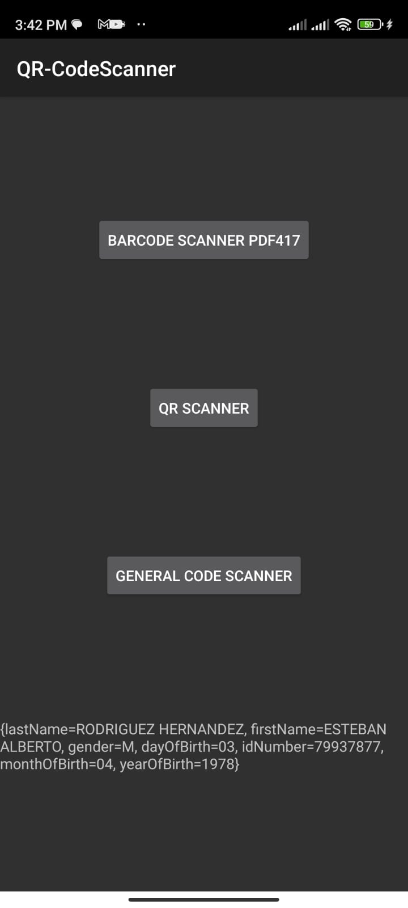
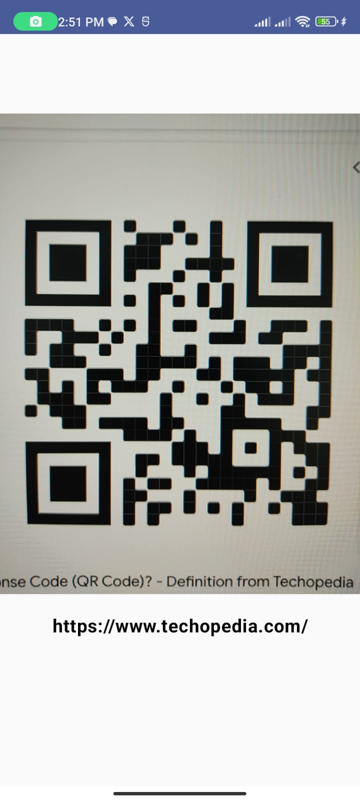
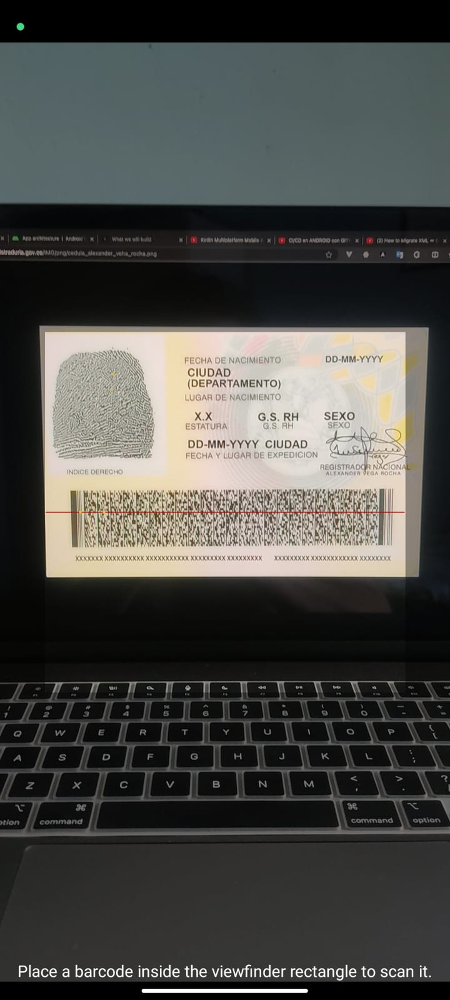

# QR CodeScanner

This is a simple QR Code Scanner demo app built on XZing library. Uses cameraX for camera preview
and Jetpack Compose for UI.

## Screenshots

The app uses two libraries for QR Code scanning. One is the XZing Core library and the other is the
zxing-android-embedded library. The XZing Core library is used for decoding the QR Code and the
zxing-android-embedded library is used for scanning the QR Code.

|               Home               |                    QRCodeScanner                     |                    General Scanner                     |
|:--------------------------------:|:----------------------------------------------------:|:------------------------------------------------------:|
|  |  |  |
